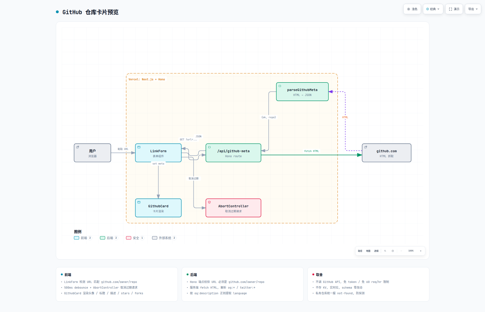

# GitHub 仓库卡片预览

> 输入 `github.com/<owner>/<repo>` 链接时,表单下方实时抓元数据并渲染卡片。

## 体验

在首页输入框粘贴一个 GitHub 仓库链接,500ms 后下方出现仓库卡片:

- owner 头像 (avatar 加载失败时降级到 GitHub 图标)
- `owner / repo` 标题
- 描述 (og:description,2 行截断)
- 语言 / ★ stars / ⑂ forks
- 整张卡片在新标签页打开仓库

支持/不支持的输入:

| 输入 | 行为 |
|---|---|
| `https://github.com/anomalyco/opencode` | 抓 og:* + og:image + avatar,渲染卡片 |
| `https://github.com/anomalyco/opencode/` | 同上 (允许尾随 /) |
| `https://github.com/vercel/next.js/issues` | **不渲染** — path 长度不等于 2,不是仓库首页 |
| `https://gist.github.com/...` | **不渲染** — 域名非 github.com |
| `https://github.com/` | **不渲染** — 无 owner/repo |
| 任何非 github 链接 | **不渲染** |
| 输入多行 | **不渲染** (被识别为 text 类型) |

## 数据流

```
┌──────────────────┐   debounce 500ms    ┌──────────────────┐
│  LinkForm <input>│ ──────────────────▶ │ /api/github-meta │
│   (检测 URL)     │                     │  server/api.ts   │
└──────────────────┘                     └──────────────────┘
        │                                          │
        │ 显示 <GithubCard>                        │ fetch(github.com/...)
        │ 或 <GithubCardLoading>                   │ parse og:* / twitter:*
        ▼                                          ▼
   ┌──────────┐                              ┌──────────────┐
   │ 用户界面 │                              │  github.com  │
   └──────────┘                              └──────────────┘
```

## 架构

> Archify 生成的 showcase 架构图(9/9 检查通过,0 errors / 0 warnings)。



可交互版本(主题切换 / 搜索 / 导出):

<iframe src="./github-preview-architecture.html" width="100%" height="780" style="border:0;border-radius:8px"></iframe>

源码:`github-preview-architecture.json` — 改完跑下面命令重生成 HTML + visual-check:

```bash
node bin/archify.mjs deliver architecture \
  docs/github-preview-architecture.json \
  docs/github-preview-architecture.html --quality showcase --json

node bin/archify.mjs visual-check \
  docs/github-preview-architecture.html --json
```

## 端点

### `GET /api/github-meta?url=<github.com/owner/repo>`

公开端点,无需鉴权。

**校验**

- 协议必须是 `http:` / `https:`
- 域名必须是 `github.com` 或 `www.github.com`
- path 必须恰好是 `/owner/repo` (允许尾随 `/`,多余段拒绝)
- `owner` / `repo` 字符集 `[A-Za-z0-9._-]{1,100}`

校验失败返回 `400 { ok:false, reason: "not-a-github-repo-url" }`。

**实现**

1. `fetch("https://github.com/<owner>/<repo>")`,加 UA / `accept-language`,关闭缓存,跟随重定向
2. 解析 HTML 中的:
   - `og:title` / `twitter:title` (兜底 `<title>`)
   - `og:description` / `twitter:description` / `<meta name="description">`
   - `og:image` / `twitter:image`
   - `<meta name="octolytics-actor-image" content="...">` (owner avatar)
   - `<span id="repo-stars-counter-star">` (stars)
   - `<span id="repo-network-counter">` (forks)
   - `og:description` 里用 `· Language ·` 模式匹配语言
3. 返回 `{ ok:true, repo: {...} }` 或 `{ ok:false, reason: "not-found" | "rate-limited" | "fetch-failed" }`

**不缓存** — 实时拉,简单,避免引入 KV schema 改动。

## 组件

### `components/github-card.tsx`

导出:

| 组件 | 用途 |
|---|---|
| `<GithubCard meta={...} />` | 主卡片。默认整张是 `<a target="_blank">` |
| `<GithubCardLoading />` | "正在抓取 GitHub 元数据…" + spin |
| `<GithubCardError reason="not-found" />` | 仓库不存在 / 私有 / 限流 / 网络错的友好提示 |

数据形状:

```ts
interface GithubRepoMeta {
  owner: string
  repo: string
  url: string              // https://github.com/owner/repo
  title: string
  description: string
  image: string | null     // og:image (absolute)
  avatar: string | null    // owner avatar (absolute)
  language: string | null
  stars: string | null     // 原始字符串,前端 formatCount 处理
  forks: string | null
}
```

### `components/link-form.tsx` 集成

```ts
useEffect(() => {
  // 1. 只在 link 类型 + URL 匹配 github.com/owner/repo 时才触发
  // 2. setTimeout 500ms debounce
  // 3. AbortController 取消过期请求
  // 4. ok=true → setGithubPreview({ state: "ok", data })
  //    ok=false → setGithubPreview({ state: "error", reason })
}, [input, isText])
```

UI 渲染位置:Textarea 之下、「检测为:短链接」之上。

## 反爬与稳定性

- GitHub 对裸 `fetch` (无 UA) 直接 429,默认 UA 已加
- 重定向到登录页 = 私有仓库,按 404 处理
- 不调 GitHub API (无 token / 无 60 req/hr 限制),只抓公开 HTML
- 不存 KV / 不限流端点自身 — 限流风险由前端 debounce + 单用户低速输入消化

## 已知限制

| 限制 | 备注 |
|---|---|
| 只支持仓库 | MVP 不识别 issue / PR / release / profile |
| stars / forks 仅前端格式化 | 后端透传原字符串,前端 `formatCount("1234")` → `"1.2k"` |
| og:image 不下载 | 仅展示 URL,引用 GitHub CDN,过期会失效 |
| 私有仓库报错友好化 | 显示「仓库不存在或为私有」,不区分两种情况,防探测 |

## 验收

- [x] typecheck 通过
- [x] 现有 155 个测试不受影响
- [x] 仅识别 `github.com/<owner>/<repo>`,其他 github 子域 / path 一律不渲染
- [x] 抓取失败 / 限流 / 私有仓库降级到友好提示,不阻塞表单提交